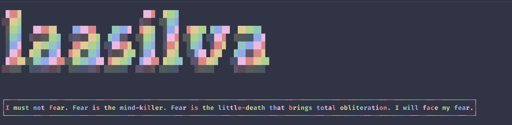
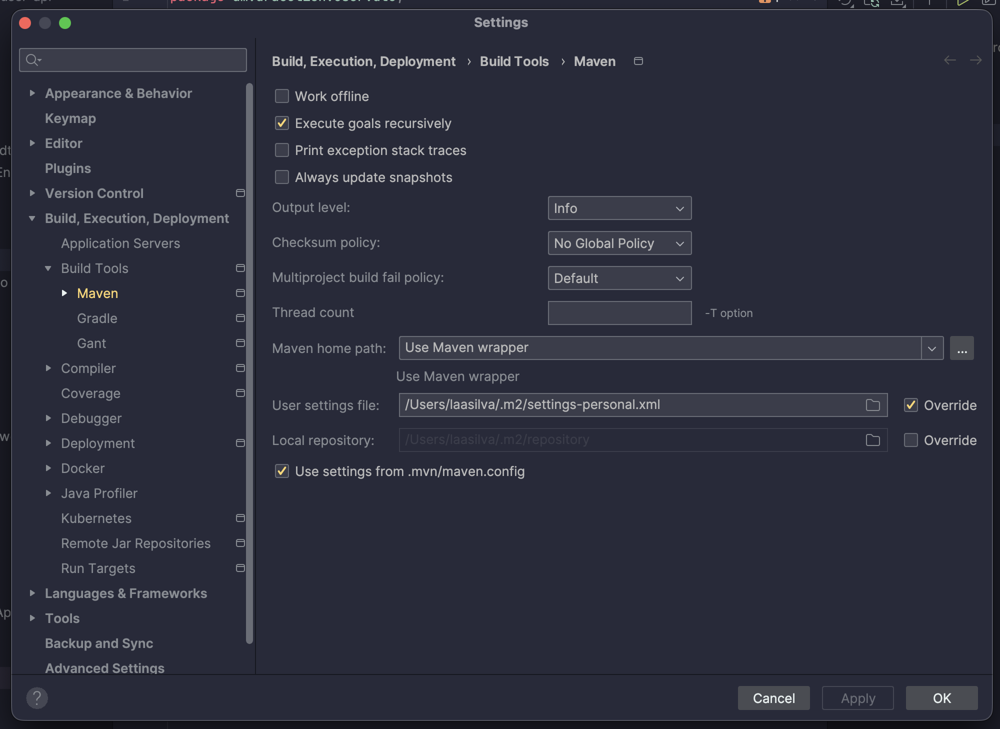

# Workspaces

## Figlet + Toilet

Use figlet and toilet to have a custom start on the terminal so it looks ✨ pretty ✨



### Installs

1. **figlet**
    
    ```bash
    brew install figlet
    ```
    
2. **toilet**
    
    ```bash
    brew install toilet
    ```
    
3. **Clone custom toilet fonts repository**
    
    ```bash
    # find the font directories
    figlet -I2
    toilet -I2
    
    # clone the custom fonts repository
    git clone https://github.com/xero/figlet-fonts.git
    
    # copy the contents to the directories outputed above
    cd figlet-fonts
    sudo cp fonts/*.flf fonts/*.tlf /opt/homebrew/path/to/figlet/fonts/
    sudo cp fonts/*.flf fonts/*.tlf /opt/homebrew/path/to/toilet/fonts/
    ```
    
4. **Add the font and filters as desired to the `.zshrc` file**
    
    ```bash
    # example as shown above
    
    toilet -f "DOS Rebel" "laasilva" --gay
    toilet -f term -w 200 --filter border:gay "I must not fear. Fear is the mind-killer. Fear is the little-death that brings total obliteration. I will face my fear."
    ```
    

## Personal vs Work spaces

### Git

Separate git users (for example, work and personal) and have a git config for each email/client.

1. Generate SSH keys for both personal and work emails
    
    ```bash
    ssh-keygen -t ed25519 -C "laasilva@proton.me"
    
    ## when asked to name it, name it something like id_ed25519_personal
    
    ssh-keygen -t ed25519 -C "larissa.silva@company.name"
    
    ## name it something like id_ed25519_work
    ```
    
2. Create separate git config files
    
    Work:
    
    ```bash
    [user]
     name = Larissa Silva
     email = larissa.silva@company.name
    ```
    
    Personal:
    
    ```bash
    [user]
     name = Larissa Silva
     email = laasilva@proton.me
    ```
    
3. Create a global config file
    
    ```bash
    Host gitlab.com
      Hostname gitlab.com
      AddKeysToAgent yes
      UseKeychain yes
      IdentityFile ~/.ssh/id_ed25519_work
      Port 22
    
    Host github.com
      Hostname github.com
      AddKeysToAgent yes
      UseKeychain yes
      IdentityFile ~/.ssh/id_ed25519_personal
      Port 22
    GSSAPIAuthentication no
    ```
    

Add all three files to `.ssh` directory and that's done.

### Maven

Use different maven repositories to be able to use both work and personal on the same environment without much switching.

1. Add a personal and separate `settings.xml` file for each environment
    
    ```xml
    <settings xmlns="http://maven.apache.org/SETTINGS/1.0.0"
              xmlns:xsi="http://www.w3.org/2001/XMLSchema-instance"
              xsi:schemaLocation="http://maven.apache.org/SETTINGS/1.0.0 https://maven.apache.org/xsd/settings-1.0.0.xsd">
      <activeProfiles>
        <activeProfile>personal</activeProfile>
      </activeProfiles>
    
      <profiles>
        <profile>
          <id>personal</id>
          <repositories>
            <repository>
              <id>github</id>
              <url>{pkg url}</url>
              <snapshots>
                <enabled>true</enabled>
              </snapshots>
            </repository>
          </repositories>
        </profile>
      </profiles>
    
      <servers>
        <server>
          <id>github</id>
          <username>laasilva</username>
          <password>{pat token}</password>
        </server>
      </servers>
    </settings>
    ```
    
Work maven settings should be the same, with company standards.

1. Override maven settings on IntelliJ IDEA

